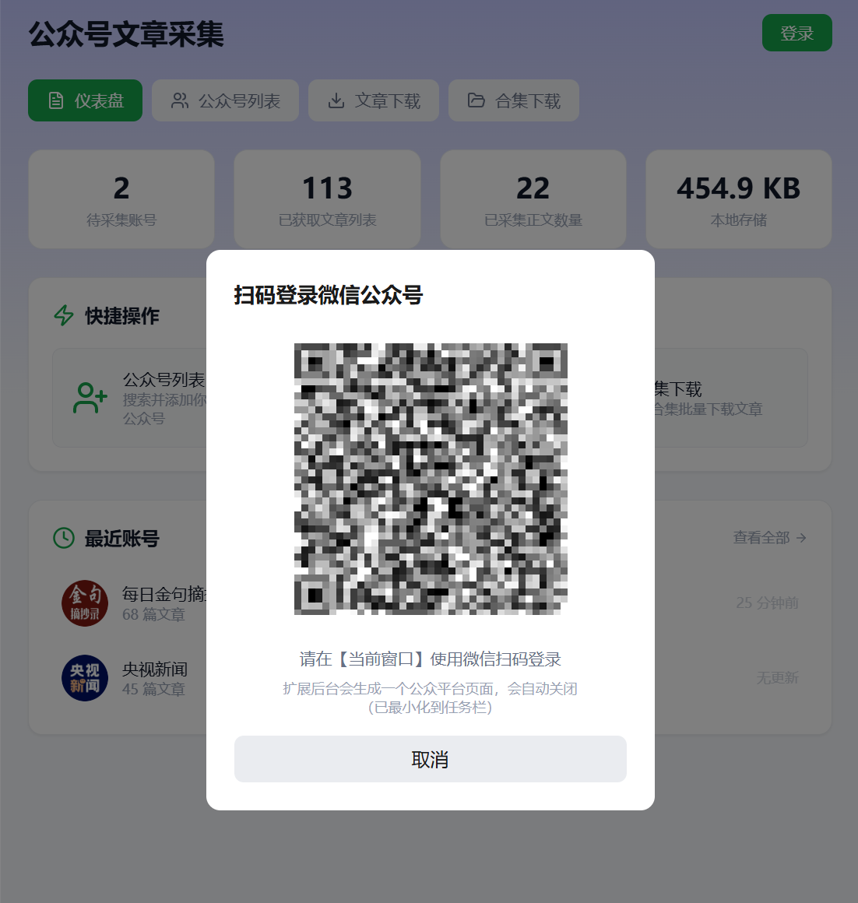
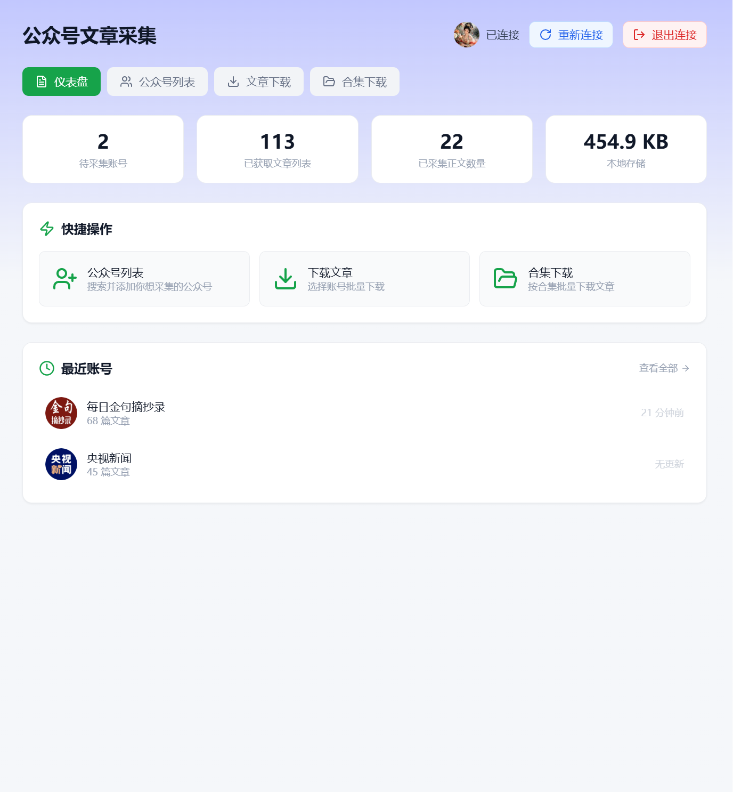
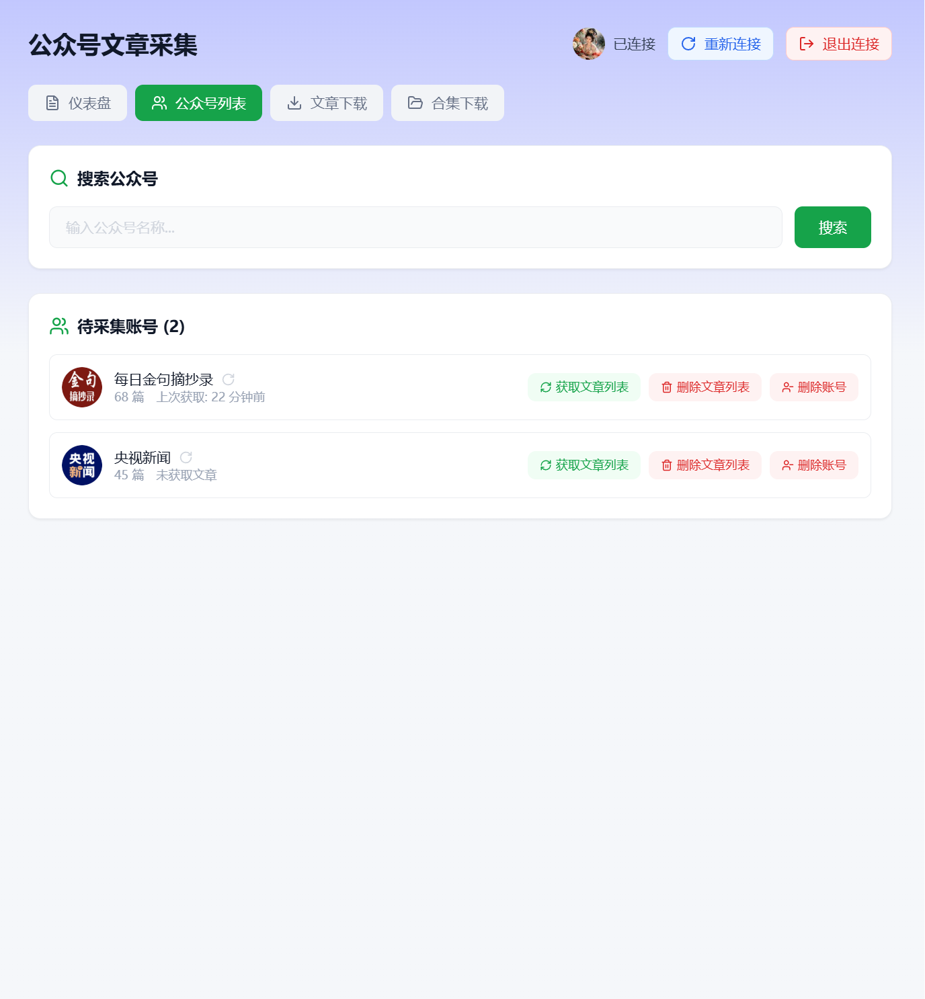
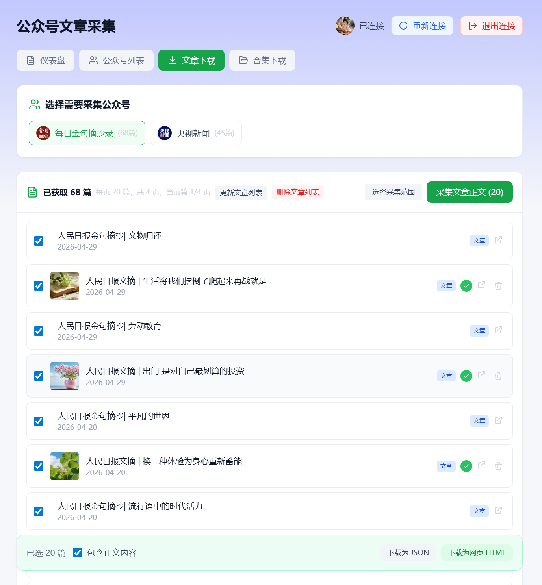
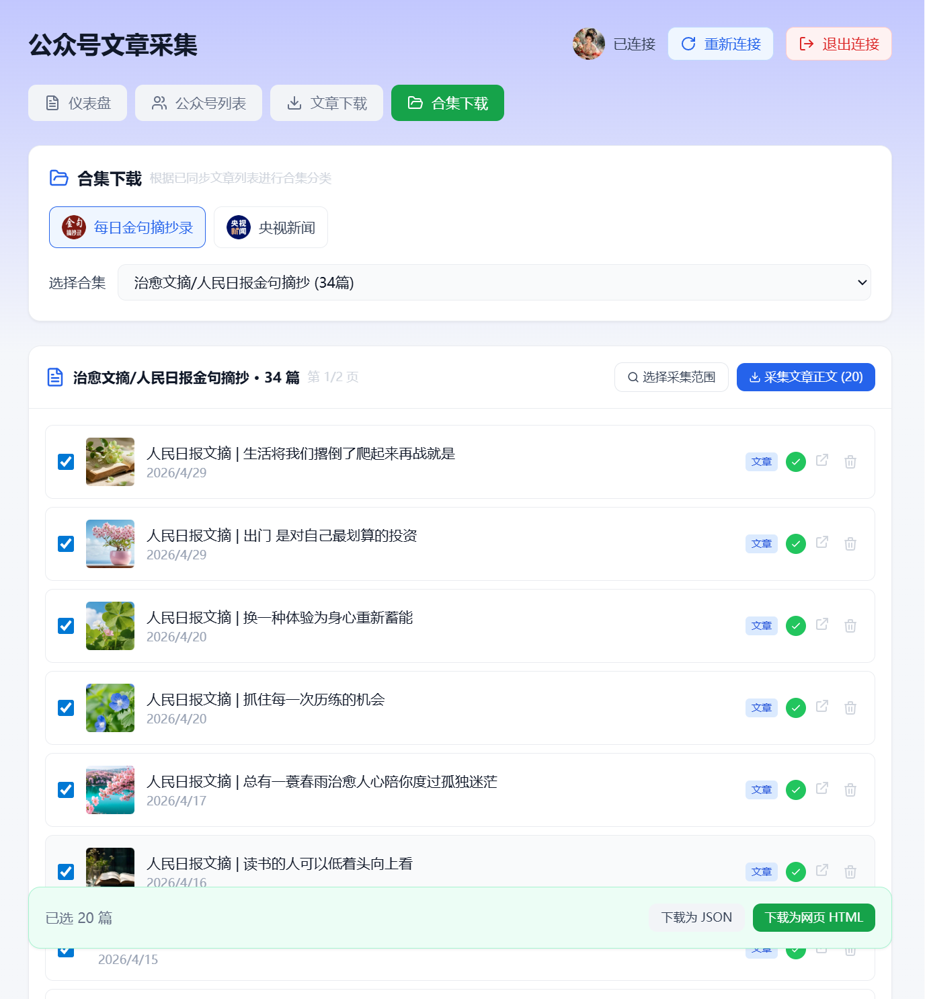
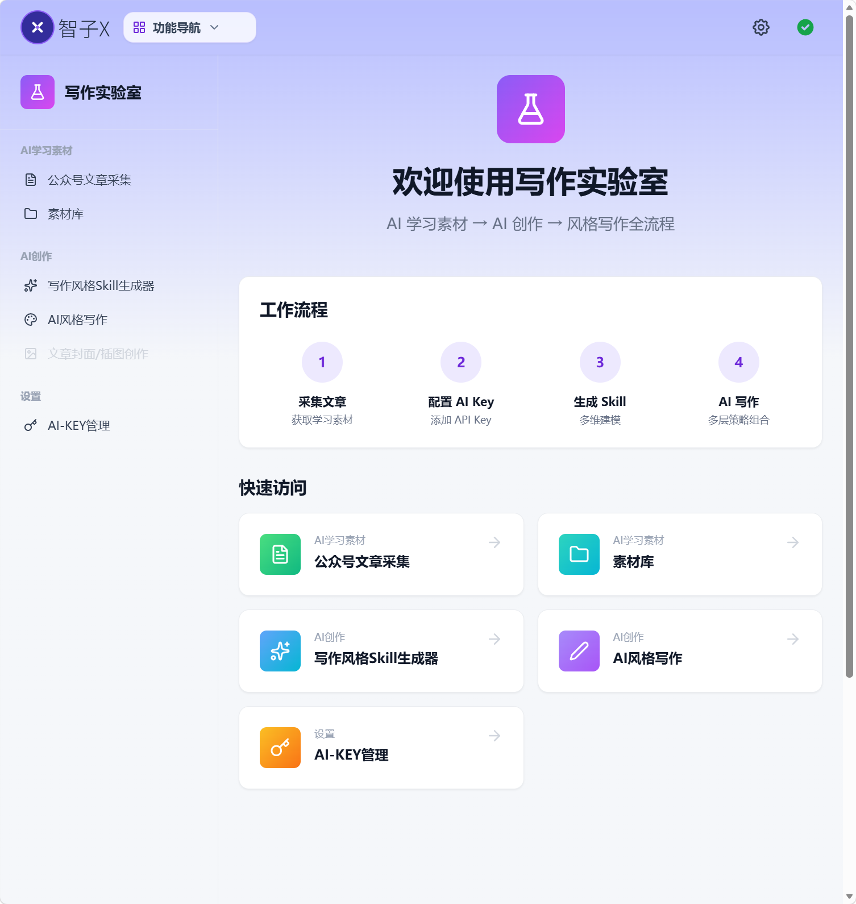

# zhizix-wx-download

基于浏览器扩展的微信公众号文章采集和下载工具：本地直连公众号后台，批量采集正文与合集，并接入 AI 写作风格建模和 Skill 创作流程。不经服务器，无需把 Cookie 交给第三方，无需本地部署，免费，开箱即用。

这个仓库是智子X写作实验室里 `wx-download` 模块独立页。

`zhizix-wx-download` 的目标是成为智子X写作实验室的素材入口：先把公众号文章整理、正文采集、合集归档做好，再把这些本地素材连接到写作风格建模、Skill 生成和 AI 风格写作，让“采集文章”真正进入“学习写法、沉淀风格、辅助创作”的完整流程。

## 功能概览

- 扫码登录微信公众号平台
- 搜索并添加需要采集的公众号
- 获取公众号历史文章列表
- 按时间范围选择文章并采集正文
- 自动识别已采集正文状态
- 从已获取的文章列表中按合集分类
- 按合集批量采集文章正文
- 下载为 JSON
- 下载为网页 HTML
- 数据保存在浏览器本地 IndexedDB

## 界面预览

### 扫码登录

### 仪表盘

### 公众号列表

### 文章采集

### 合集采集

## 和智子X写作实验室联动

`wx-download` 不是孤立的下载工具。采集后的公众号文章可以直接作为智子X写作实验室的学习素材，进入后续的 AI 写作工作流：

1. **采集正文**：先用本模块获取公众号文章列表，并采集文章正文。
2. **选择样本**：在智子X的写作风格建模工具中，直接选择已采集的文章作为分析样本。
3. **风格建模**：AI 会分析文章的表达方式、结构节奏、叙事习惯、修辞特征、情绪曲线等维度。
4. **生成 Skill**：把分析结果整理成可复用的写作风格 Skill。
5. **学习创作**：在 AI 风格写作中调用该 Skill，用于学习优秀文章的写法、生成结构草稿、改写自己的内容或辅助原创创作。

简单说：`wx-download` 负责把合法文章素材采集到本地，智子X负责把这些素材转化为可学习、可复用、可创作的写作风格能力。

## 为什么需要浏览器扩展

本模块依赖智子X浏览器扩展。微信公众号后台接口需要登录态，网页端还会受到浏览器 CORS 限制。扩展负责在用户本地浏览器中完成平台认证和请求转发，让请求从你的浏览器直接发往微信公众号平台。

关键边界：

- Cookie 只在你的浏览器和扩展之间使用，不上传到智子X服务器。
- 文章列表和正文保存在你的浏览器本地 IndexedDB。
- 智子X服务器不保存你的公众号数据，不代理你的平台请求。
- 扩展只提供本地直连能力，不提供任何内容源。

### 扩展安装：

#### Chrome浏览器

1. 访问 [Chrome Web Store（智子X）](https://chromewebstore.google.com/detail/%E6%99%BA%E5%AD%90x/kkikcckpibabkmpghjgadakjmgbcfmpp)
2. 点击"添加至Chrome"
> **提示：Chrome商店的扩展支持所有浏览器添加，如果你用QQ浏览器，也可以点击"添加至Chrome"**

#### Edge浏览器

1. 访问 [Edge加载项商店（智子X）](https://microsoftedge.microsoft.com/addons/detail/%E6%99%BA%E5%AD%90x/hephafomnbepcjnjdcbeookcjfkghfie)
2. 点击"获取"

#### 手动添加方法（ZIP），适用于所有浏览器

> **如果你无法访问扩展商店，可以下载 ZIP 压缩包，按扩展仓库 4 步手动安装。**

- 扩展源码仓库：https://github.com/zhiziX/zhiziX-extension

## 使用流程

1. 安装并启用智子X浏览器扩展。
2. 打开[https://zhizix.com/writer-lab/wx-download](https://zhizix.com/writer-lab/wx-download)在线使用：
3. 使用微信扫码登录微信公众号平台。
4. 在“公众号列表”中搜索并添加需要采集的公众号。
5. 获取文章列表。
6. 在“文章下载”中选择采集范围并采集文章正文。
7. 如需按合集整理，在“合集下载”中选择合集并采集正文。
8. 将选中的文章下载为 JSON 或网页 HTML。

## 数据与隐私

本模块采用本地优先设计：

- 账号信息、文章列表、正文缓存保存在浏览器 IndexedDB。
- 导出的 JSON 和 HTML 文件由浏览器本地生成。
- 清理浏览器数据、重装浏览器或更换设备可能导致本地数据丢失。
- 建议定期导出重要数据并自行备份。

## 合法使用边界

请只采集你有权访问、备份、研究或使用的内容。使用者需要自行确保：

- 遵守微信公众号平台规则。
- 尊重原创作者和内容版权。
- 不将未授权内容用于商业搬运、批量洗稿或侵权用途。
- 不进行恶意自动化请求或造成平台服务负担。

工具本身是中立的，具体使用行为和后果由使用者自行承担。

## 适合谁使用

- 自媒体创作者整理自己的公众号历史文章
- 内容团队备份和归档自有内容
- 写作者收集合法授权的学习样本
- 研究者分析公开内容的结构、标题、节奏和表达方式